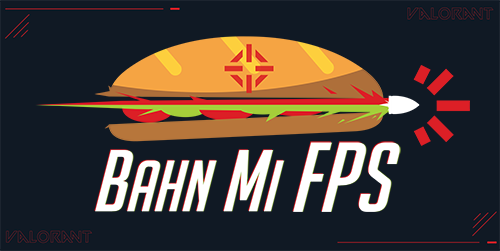

<!-- PROJECT LOGO -->
 

  

  <h3 align="center">Calculator</h3>

  

    My attempt at a Calculator app built using HTML, CSS, and plain Javascript
     
     
     
    <a href="https://bahnmifps-calculator.netlify.app/">View Demo</a>
    ·
    <a href="https://github.com/BahnMiFPS/calculator/issues">Report Bug</a>
    ·
    <a href="https://github.com/BahnMiFPS/calculator/issues">Request Feature</a>
  

<!-- ABOUT THE PROJECT -->

## About The Project

[![Product Name Screen Shot][product-screenshot]](https://bahnmifps-calculator.netlify.app/)

There are many great README templates available on GitHub; however, I didn't find one that really suited my needs so I created this enhanced one. I want to create a README template so amazing that it'll be the last one you ever need -- I think this is it.

Here's why:

- Your time should be focused on creating something amazing. A project that solves a problem and helps others
- You shouldn't be doing the same tasks over and over like creating a README from scratch
- You should implement DRY principles to the rest of your life :smile:

Of course, no one template will serve all projects since your needs may be different. So I'll be adding more in the near future. You may also suggest changes by forking this repo and creating a pull request or opening an issue. Thanks to all the people have contributed to expanding this template!

Use the `BLANK_README.md` to get started.

(<a href="#readme-top">back to top</a>)

<!-- ROADMAP -->

## Roadmap

- [ ] Ability to overlap operators.
- [ ] Better Del button.
- [ ] Add decimals.
- [ ] Fix html hardcodes

(<a href="#readme-top">back to top</a>)

<!-- CONTACT -->

## Contact

BahnMiFPS - [@your_twitter](https://twitter.com/your_username) - email@example.com

Project Link: [https://github.com/your_username/repo_name](https://github.com/your_username/repo_name)

(<a href="#readme-top">back to top</a>)

[product-screenshot]: images/screenshot.png
